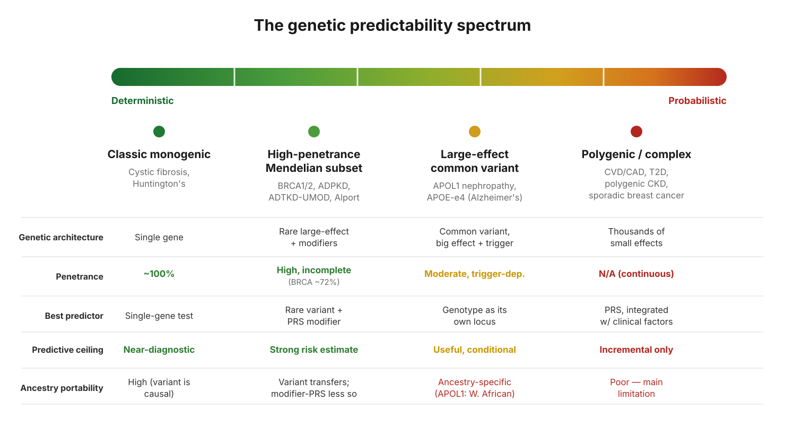

Most of us carry a simple mental model of genetic testing: find the mutation, know the risk. For a small set of diseases that model holds. For the far larger set of common diseases, it quietly breaks down, and the reason it breaks down is worth understanding before you ever look at a risk number.

## Starting with the case that works

Take BRCA1. You have probably seen a figure like "a BRCA1 mutation carries about a 72 percent lifetime risk of breast cancer." That number is real. It comes from large studies that followed thousands of carriers forward in time and used survival analysis to estimate cumulative risk to a given age [@kuchenbaecker2017].

BRCA works as a predictor for a specific reason: it is a single gene with a large effect. The mutation is identified, it is causal, and it points at something real and specific about the person carrying it. Even here the number is a population average with meaningful spread around it, but the prediction has a solid anchor. This is the friendly end of genetics, where one variant does most of the explaining.

Most common diseases do not look like this. Heart disease, type 2 diabetes, and the like are not driven by one large-effect gene. They are driven by thousands of tiny genetic contributions plus environment, behaviour, and age. To say anything genetic about risk in those diseases, you need a different tool. That tool is the polygenic risk score.

## What a PRS actually is

A polygenic risk score is a weighted sum of many small genetic effects. Genome-wide association studies find variants that nudge risk up or down by a tiny amount each, and a PRS adds them all together into a single number that places you somewhere on a population distribution.

PRS was not originally built to predict anyone's disease. The method that established the modern PRS, a 2009 schizophrenia study [@purcell2009], used it as a research instrument. The goal was to prove that a trait was polygenic at all, and to test whether different disorders shared genetic architecture. Predicting individual risk was not the point, and the accuracy for any single person was deliberately beside the point. Individual prediction came later, once study sizes grew large enough that the scores carried real signal.

## What a PRS can tell you

It gives you a real position in a distribution. Your score is your score, and being in the top slice of the distribution does correspond to elevated risk on average. In diseases like coronary artery disease, large prospective studies have shown that people in the highest PRS group face substantially higher risk than the middle of the distribution, and that this holds up when you follow people forward and count who actually develops disease [@khera2018].

It adds information on top of what clinicians already measure. The most defensible use of a PRS is not on its own but folded in alongside age, blood pressure, cholesterol, family history, and other established factors. It contributes something those factors miss, and that increment can be enough to shift a real decision, such as starting a medication earlier or screening someone sooner.

## What a PRS can't tell you

It is a ranking, not a diagnosis. Unlike a BRCA result, there is no clean carrier or non-carrier. A PRS is a smooth gradient, and the "top 1 percent" cutoff that produces scary headlines is an arbitrary line drawn through a continuous distribution. Someone just above the line and someone just below it are barely different.

Its absolute numbers are fragile. A PRS can rank people reasonably well while still getting the absolute risk figure wrong, because that figure depends on the score being properly calibrated to the population you are applying it to.

And this is the largest limitation: PRS often does not transfer well across ancestries [@martin2019]. Because most of the underlying studies were done in people of European ancestry, a score built there can lose much of its accuracy when applied to people of African, East Asian, or other backgrounds. A risk number that looks precise can simply be miscalibrated for the person in front of you. This is an active area of work, with multi-ancestry studies trying to close the gap, but it remains the central caution.

## The takeaway

BRCA and a polygenic risk score sit at opposite ends of the same spectrum. BRCA is one large-effect gene, and its prediction is anchored and close to diagnostic. A PRS is thousands of small effects summed together, and its prediction is a probability, not a destiny.

The key idea is that predictability depends on how concentrated the genetic effect is, not on how "genetic" a disease is. A disease can be strongly heritable and still be hard to predict, because that heritability is scattered across thousands of tiny pieces that no single number captures cleanly.

A PRS is a calibrated probability that can meaningfully move a decision.

## References

::: {#refs}
:::
